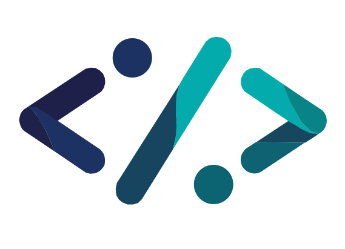

<a name="readme-top"></a>

[![Contributors][contributors-shield]][contributors-url]
[![Forks][forks-shield]][forks-url]
[![Stargazers][stars-shield]][stars-url]
[![Issues][issues-shield]][issues-url]
[![LinkedIn][linkedin-shield]][linkedin-url]

<!-- PROJECT LOGO -->
<br />
<div align="center">
<a href="https://github.com/sarthak-dhaduk/Virtual-Collab-Studio">
  
</a>

  <h3 align="center">Virtual Collab Studio (VC Studio)</h3>

  <p align="center">
    An innovative collaborative coding platform for seamless teamwork and code sharing.
    <br />
    <a href="https://github.com/sarthak-dhaduk/Virtual-Collab-Studio"><strong>Explore the docs »</strong></a>
    <br />
    <br />
    <a href="https://github.com/sarthak-dhaduk/Virtual-Collab-Studio/archive/refs/heads/main.zip">Download ZIP</a>
    ·
    <a href="https://github.com/sarthak-dhaduk/Virtual-Collab-Studio/issues/new?labels=bug&template=bug-report---.md">Report Bug</a>
    ·
    <a href="https://github.com/sarthak-dhaduk/Virtual-Collab-Studio/issues/new?labels=enhancement&template=feature-request---.md">Request Feature</a>
  </p>
</div>

</br>
</br>
</br>

<!-- TABLE OF CONTENTS -->

### 🧭 Navigations for exploration

---

<p align="center">
  <a href="#-about-the-project">📌 About The Project</a> • 
  <a href="#-key-features">✨ Key Features</a> • 
  <a href="#%EF%B8%8F-built-with">🛠️ Built With</a> • 
  <a href="#-ui-design">🎨 UI Design</a> • 
  <a href="#-getting-started">🚀 Getting Started</a> 
</p>

<p align="center">
  <a href="#-prerequisites">📋 Prerequisites</a> • 
  <a href="#-installation">📦 Installation</a> • 
  <a href="#%EF%B8%8F-running-the-project">▶️ Running the Project</a> • 
  <a href="#-usage">💡 Usage</a> • 
  <a href="#-contributing">🤝 Contributing</a> • 
  <a href="#-contact">📧 Contact</a> 
</p>

---


</br>
</br>
</br>

<!-- ABOUT THE PROJECT -->

## 📌 About The Project

"Virtual Collab Studio (VC Studio)" is a collaborative coding platform designed for teams to code together in real time, share ideas, and publish their work for the community. Built as a project by Sarthak Dhaduk, Yash Lalani, and Jigar Kalariya, it features a seamless blend of collaborative coding and a blog-style sharing interface.

The project consists of two components within one project directory **Virtual-Collab-Studio**:

1. **VC-Studio-Server:**

   - An **Express.js** project utilizing **WebSockets** and APIs for real-time collaboration.

2. **VC-Studio-Client:**
   - A **React.js** project built with **Bootstrap** for UI styling and API integration.

</br>

[![Project Overview][product-screenshot]]()

</br>

## ✨ Key Features

- **Collaborative Workspace:** Create and join real-time coding sessions using a unique workspace ID.
- **Code Editor & Compiler:** Work collaboratively on code with live compilation support.
- **Community Blog:** Share code snippets with titles and descriptions, allowing others to review and rate them.
- **Real-Time Communication:** Use WebSocket technology for instant updates and seamless interaction.
- **Open Source:** A community-driven project open for contributions and enhancements.

<p align="right">(<a href="#readme-top">back to top</a>)</p>

## 🛠️ Built With

This section list all the technologies used for building the web application.

- [![React][React]][React-url]
- [![Vite][Vite]][Vite-url]
- [![Bootstrap][Bootstrap]][Bootstrap-url]
- [![Express.js][Express]][Express-url]
- [![MongoDB][MongoDB]][MongoDB-url]
- [![API][API]][API-url]
- [![WebSockets][WebSockets]][WebSockets-url]
- [![Node.js][NodeJS]][NodeJS-url]

<p align="right">(<a href="#readme-top">back to top</a>)</p>

## 🎨 UI Design

The user interface of "Virtual Collab Studio" has been meticulously crafted to provide a user-friendly and efficient collaborative coding experience. From real-time code editing to blog functionality, the design ensures an intuitive and engaging experience.

You can explore the complete UI design on Figma using the link below:

[](https://www.figma.com/design/dS6tIrJ03cLN41jJmvKMpr/Virtual-Collab-Studio?node-id=0-1&t=pS4vUxGyLqiDXKxL-1)

<p align="right">(<a href="#readme-top">back to top</a>)</p>

<!-- GETTING STARTED -->

## 🚀 Getting Started

Follow these instructions to set up and run the **Virtual Collab Studio** project locally.

---

### 📋 Prerequisites

Before running the project, ensure you have the following installed:

- **Node.js & npm**
  - Download and install [Node.js](https://nodejs.org/) (npm comes with Node.js).
  - Verify installation:
    ```sh
    node -v
    npm -v
    ```
- **MongoDB** (Local or Cloud)

  - Install [MongoDB](https://www.mongodb.com/try/download/community) for local use.
  - Alternatively, use **MongoDB Atlas** for a cloud database.
  - Start MongoDB locally:
    ```sh
    mongod
    ```

- **Git**
  - Download and install [Git](https://git-scm.com/downloads).
  - Verify installation:
    ```sh
    git --version
    ```

---

### 📦 Installation

_Follow these steps to install and run the project locally:_

1. **Clone the repository:**

   ```sh
   git clone https://github.com/sarthak-dhaduk/Virtual-Collab-Studio.git
   ```

   ```sh
   cd Virtual-Collab-Studio
   ```

2. **Install Dependencies for Both Backend and Frontend:**

   ```sh
   npm run install-all
   ```

3. **Configure MongoDB Connection:**

   - Navigate to `VC-Studio-Server/config/db.js` (or wherever the connection file is located).
   - Replace the default MongoDB connection string with your local or cloud connection string.
   - Example:

     ```js
     const mongoose = require("mongoose");

     mongoose
       .connect("mongodb://localhost:27017/yourDatabaseName", {
         useNewUrlParser: true,
         useUnifiedTopology: true,
       })
       .then(() => console.log("MongoDB Connected!"))
       .catch((err) => console.error("MongoDB Connection Error:", err));
     ```

---

### ▶️ Running the Project

After completing all setup steps, start both the **backend** and **frontend** simultaneously using `concurrently`:

```sh
npm run start
```

Your **Virtual Collab Studio** project should now be running locally! 🚀

<p align="right">(<a href="#readme-top">back to top</a>)</p>

<!-- USAGE EXAMPLES -->

## 💡 Usage

"Virtual Collab Studio" is designed to simplify collaborative coding and community sharing. Here are some use cases:

- **Real-Time Collaboration:**

  - Create or join a workspace using a unique ID and code collaboratively in real-time.

- **Community Blogging:**

  - Share code snippets with titles and descriptions on the blog page.
  - Rate and review posts from the community.

- **Code Compilation:**
  - Write and compile code directly within the collaborative editor.

<p align="right">(<a href="#readme-top">back to top</a>)</p>

<!-- CONTRIBUTING -->

## 🤝 Contributing

Contributions are what make the open-source community such an amazing place to learn, inspire, and create. Any contributions you make are **greatly appreciated**.

1. Fork the Project
2. Create your Feature Branch (`git checkout -b feature/AmazingFeature`)
3. Commit your Changes (`git commit -m 'Add some AmazingFeature'`)
4. Push to the Branch (`git push origin feature/AmazingFeature`)
5. Open a Pull Request

<p align="right">(<a href="#readme-top">back to top</a>)</p>

<!-- CONTACT -->

## 📧 Contact

Maintenance Team:

- **Sarthak Dhaduk** - [sarthakdhaduk1111@gmail.com](mailto:sarthakdhaduk1111@gmail.com)
- **Yash Lalani** - [yashlalani43@gmail.com](mailto:yashlalani43@gmail.com)
- **Jigar Kalariya** - [jigar.kalariya28@gmail.com](mailto:jigar.kalariya28@gmail.com)

<p align="right">(<a href="#readme-top">back to top</a>)</p>

<!-- MARKDOWN LINKS & IMAGES -->
<!-- https://www.markdownguide.org/basic-syntax/#reference-style-links -->

[logo]: VC-Studio-Client/public/icon2.svg
[contributors-shield]: https://img.shields.io/github/contributors/sarthak-dhaduk/Virtual-Collab-Studio.svg?style=for-the-badge
[contributors-url]: https://github.com/sarthak-dhaduk/Virtual-Collab-Studio/graphs/contributors
[forks-shield]: https://img.shields.io/github/forks/sarthak-dhaduk/Virtual-Collab-Studio.svg?style=for-the-badge
[forks-url]: https://github.com/sarthak-dhaduk/Virtual-Collab-Studio/network/members
[stars-shield]: https://img.shields.io/github/stars/sarthak-dhaduk/Virtual-Collab-Studio.svg?style=for-the-badge
[stars-url]: https://github.com/sarthak-dhaduk/Virtual-Collab-Studio/stargazers
[issues-shield]: https://img.shields.io/github/issues/sarthak-dhaduk/Virtual-Collab-Studio.svg?style=for-the-badge
[issues-url]: https://github.com/sarthak-dhaduk/Virtual-Collab-Studio/issues
[linkedin-shield]: https://img.shields.io/badge/-LinkedIn-black.svg?style=for-the-badge&logo=linkedin&colorB=555
[linkedin-url]: https://linkedin.com/in/sarthak-dhaduk
[product-screenshot]: VC-Studio-Client/public/Thumbnail.png
[React]: https://img.shields.io/badge/React-61DAFB?style=for-the-badge&logo=react&logoColor=black
[React-url]: https://react.dev/
[Vite]: https://img.shields.io/badge/Vite-FDCB58?style=for-the-badge&logo=vite&logoColor=black
[Vite-url]: https://vitejs.dev/
[Bootstrap]: https://img.shields.io/badge/Bootstrap-6F42C1?style=for-the-badge&logo=bootstrap&logoColor=white
[Bootstrap-url]: https://getbootstrap.com/
[Express]: https://img.shields.io/badge/Express.js-303030?style=for-the-badge&logo=express&logoColor=white
[Express-url]: https://expressjs.com/
[MongoDB]: https://img.shields.io/badge/MongoDB-47A248?style=for-the-badge&logo=mongodb&logoColor=white
[MongoDB-url]: https://www.mongodb.com/
[API]: https://img.shields.io/badge/API-FF5733?style=for-the-badge&logo=fastapi&logoColor=white
[API-url]: #
[WebSockets]: https://img.shields.io/badge/WebSockets-0085CA?style=for-the-badge&logo=socket.io&logoColor=white
[WebSockets-url]: https://socket.io/
[NodeJS]: https://img.shields.io/badge/Node.js-339933?style=for-the-badge&logo=node.js&logoColor=white
[NodeJS-url]: https://nodejs.org/
